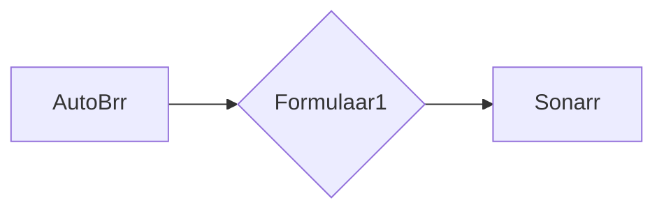

# Formulaar1

[](https://github.com/avassdal/Formulaar1/actions/workflows/ci.yml)

A small tool that automates Formula 1, Formula 2, and Formula 3 release pushes to Sonarr. It intercepts releases from AutoBrr, matches them to the correct TVDB episode, and forwards them to Sonarr with the correct metadata.

Hardlinking is supported on Linux, macOS, and Windows.



## Requirements

- [.NET 10 Runtime](https://dotnet.microsoft.com/en-us/download/dotnet/10.0)
- Sonarr v3
- qBittorrent (with Web UI enabled)

## Install Guide

### Pre-Built Binary

1. Download the latest release from [GitHub Releases](https://github.com/avassdal/Formulaar1/releases).

2. Extract into a folder.

3. Edit `appsettings.json` with your settings:

   ```json
   {
     "TorrentClient": "qBittorrent",
     "Hardlinkpath": "/full/path/to/hardlink/folder",
     "APICredentials": {
       "Sonarr": {
         "ApiKey": "",
         "BasePath": "http://127.0.0.1:8989"
       },
       "qBittorrentClient": {
         "Username": "",
         "Password": "",
         "BasePath": "http://127.0.0.1:10169"
       },
       "bugsnag": {
         "apiKey": "",
         "enabled": false
       }
     }
   }
   ```

   | Setting | Description |
   | --- | --- |
   | `TorrentClient` | Currently only `qBittorrent` is supported |
   | `Hardlinkpath` | Folder where hardlinks are created before Sonarr imports them |
   | `Sonarr.ApiKey` | Found in Sonarr → Settings → General |
   | `Sonarr.BasePath` | Full URL to your Sonarr instance |
   | `qBittorrentClient.BasePath` | Full URL to your qBittorrent Web UI |
   | `bugsnag.apiKey` | Optional — your own Bugsnag project API key for error reporting |
   | `bugsnag.enabled` | Set to `true` if you supply a Bugsnag API key |

4. Start Formulaar1:

   ```sh
   ./Formulaar1
   ```

   You should see output like:

   ```log
   info: Microsoft.Hosting.Lifetime[14]
        Now listening on: http://localhost:5000
   ```

5. In AutoBrr, create a new client with:
   - **Type:** Sonarr
   - **Host:** `http://127.0.0.1:5000` (or whichever port Formulaar1 is listening on)
   - **API Key:** your normal Sonarr API key

   Clicking **Test** should return a green OK.

6. Set up an AutoBrr filter pointing to this new client. That's it!

## Supported Series

| Series | TVDB ID |
| --- | --- |
| Formula 1 | 387219 |
| Formula 2 | 392717 |
| Formula 3 | 396724 |

## Issues

Please raise any issues if you have any problems.
